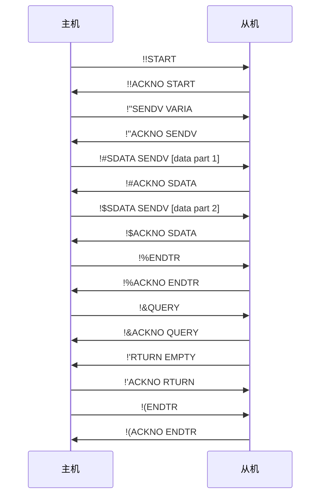
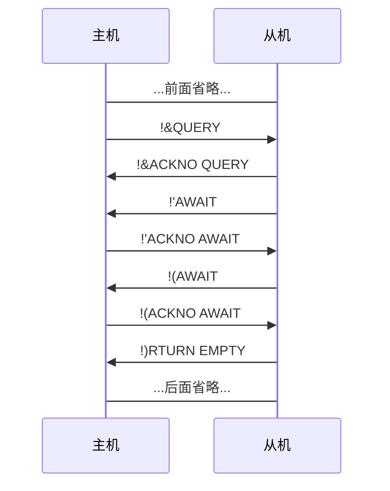
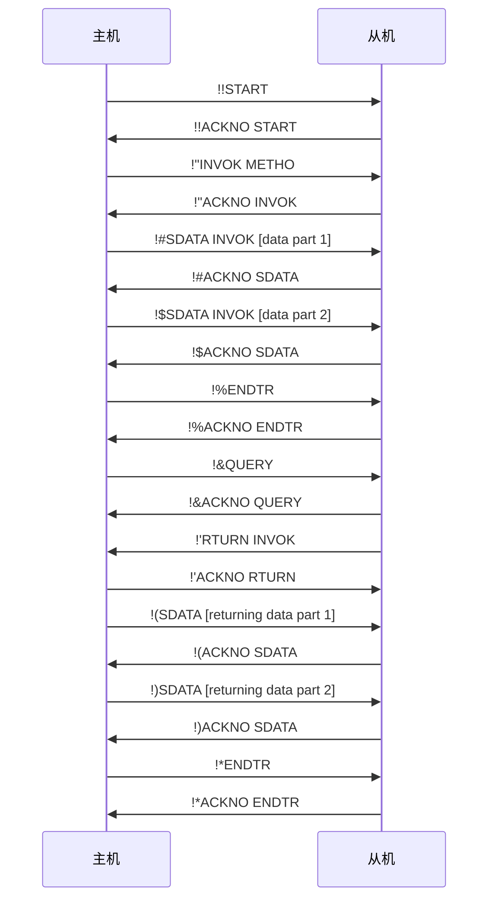
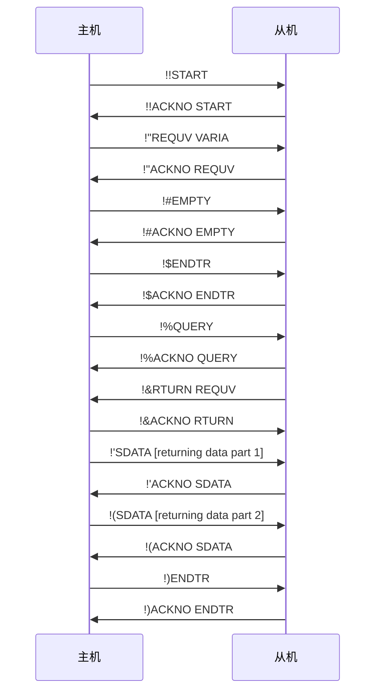

<!-- markdownlint-disable MD040 -->
# PK 指令规范（口语版）

## 概述

PK 指令是一个轻量的、专为受限信道（尤其是 HID）下灵活通信而设计的传输格式。

## 概览

一个传输流程如下：



## 介绍

### 术语

- 主机和从机（Sender/Receiver）：上述图解区分了主机端和从机端，但实际上 PK 指令并不限制某个特定的客户端一定是主机或从机。因此，为了叙述方便，我们称“发起传输的一方”为主机端（Sender），“回应传输的一方”为从机端（Receiver）。
- 指令（Command）：指一条 PK 指令，或容纳了一条 PK 指令的数据包。
- 命令/操作（Operation）：指一条 PK 指令执行的操作。如设置变量（`SENDV`）、承认数据包（`ACKNO`）等。
- 链（Chain）：一个“传输流程”。（在下文介绍）

### “命令”是什么？

在 PK 指令的设计中，“命令”或“操作”是**一条指令做的事情**。命令有三个要素：

|要素|含义|
|:---:|---|
|名称|这个命令的名称。（类似于 HTTP 的方法）|
|对象|这个命令**要操作的东西**。（类似于 HTTP 的路径）|
|数据|这个命令**要对那个东西做什么**。（类似于 HTTP 的请求体）|

### 链（传输流程）

上面的图解描述了一个完整的传输流程，我们把它称为**链**。

链指的是执行一个操作的过程中双方交换的所有指令。这些指令都为了一个主要的操作（如上面的设置变量 `SENDV`）服务，我们把这个主要的操作称为该链的**根命令**，剩下的则称为**子命令**。

### 指令结构

如图所示，每一条 PK 指令都有一个相对固定的格式，如下：

```
[MSG ID][OPERATION NAME] [OBJECT] [DATA]
```

以下是对各部分的解释：

|部分|位数|含义或作用|可选|
|:---:|:---:|---|:---:|
|`MSG ID`|2|一个 94 进制数字，使用 ASCII 中除去空格的所有可显示字符（即 0x21 `!` 到 0x7D `~`）来表示，用于 ACK 机制。|否|
|`OPERATION NAME`|5|命令名称|否|
|`OBJECT`|5|操作对象|是|
|`DATA`|不限|操作携带的数据（参数/返回值）|是|

不难发现，在 PK 指令中，每一部分（除了 `DATA`）都有一个固定的位数，主要是为了解析方便。`DATA` 前面的部分占用了 14 位，然后数据包的剩余空间可以用来存放 `DATA`。同时这也说明，原则上，`DATA` 存在时不能省去 `OBJECT` 部分。

### 数据传入与回传

一个根命令可能有传入数据，也有可能有传出数据。根命令所属的指令本身不携带这些数据，而是藉由一系列子命令来交换。

在图解中的例子，“设置变量”（`SENDV`）这个根命令有传入数据，即要对变量设置的值。传入时，在从机承认了需传入数据的根命令后，使用 `SDATA` 子命令发送分片数据，并以 `ENDTR` 子命令结束。

如果有传出数据，在主机端收到 `ENDTR` 的 ACK 后使用 `QUERY` 命令请求。值得注意的是，`QUERY`命令发送后，由于数据传输的主体改变，**由主机端进行 ACK**。接收到 `QUERY` 命令后，从机用 `RTURN` 示意是否有回传数据（有→对象是初始命令名；没有→对象是`EMPTY`），然后和传入时类似，用 `SDATA` 发送分片数据。

最终，主机方再次发送 `ENDTR` 示意传输结束。

### ACK 机制

因为嵌入式开发面对的是“裸信道”，即不是很可靠的传输环境，PK 指令设计了一个简易的 ACK 机制。

当主机给从机发送指令时，从机要回复 `ACKNO`。

```
[MSG ID]ACKNO [COMMAND NAME]
```

此处 `MSG ID` 和 `COMMAND NAME` 和“被承认”的指令中 ID 及命令名保持一致，以保证信息传递的有序和连贯性。主机收到 ACK 时需要检查上述信息是否一致，否则终止传输。

为了防止丢包，ACK 有超时机制。如果主机（或回传数据时的从机）在超时时间内未收到相应的 ACK 信息，则重新发送该条指令。（如果是主机未收到 ACK 包，再次发送后从机亦可根据 ID 判断是新数据，还是需要发送 ACK 包。）

为了保持 ACK 的可靠性，每个数据包的 ID **跨链累积**（即编号不随 `ENDTR` 而归零，持续递增）。编号递增到 `~~`（8835）时，再令数据包的 ID 为 `!!`（0）。

#### 长连接

有些时候（如使用 `INVOK` 调用方法的时候），可能需要较长时间才结束方法，这时以一定间隔持续发送 `AWAIT` 指令来保活。

如：



### 错误情况

在 PK 的设计中，可能的错误情况十分有限，如：

- 不合理的指令（如无法解析、命令名不存在、操作对象不存在等）
- 偶然性错误（即由于随机的不可抗力因素导致的错误，如 ACK 了一个错误的包）
- 超时
- 其他故障

对于错误情况，检查到错误的一方应发送以下错误描述指令：

```
  ERROR ERROR [description]
```

`MSG ID` 部分固定为两个空格，命令名和对象固定为“ERROR”，DATA 部分为用英语写的错误描述。

请注意错误包仍然需要 ACK，ID 同样固定为两个空格，如果超时则重新声明错误。

收到/发出错误描述后，当前链作废，重新开始本次数据交换。

> [!CAUTION]
> PK 指令的错误处理**并不可靠**。我们假定使用 PK 指令沟通的两个设备有极强的关联性（如硬件和对应的驱动程序），因此 PK 指令没有复杂的错误机制。错误机制的设计是基于**非偶然性错误应在开发环境发现并排除**的假设，实际上只能处理“在确定的不会出错的运行状态下发生的随机性错误”，并不像 HTTP 那样囊括了所有情况。所以在设计基于 PK 的应用时应小心这一点。

### 命令列表

以下是规范的命令列表。

|名称|介绍|对象|传入数据|传出数据|根命令|
|:---:|:---:|:---:|:---:|:---:|:---:|
|SENDV|设置目标设备上的变量|变量名|变量内容|❌|是|
|REQUV|获取目标设备上的变量|变量名|❌|变量内容|是|
|INVOK|调用目标设备上的方法|方法名|传递给方法的参数|方法的返回值|是|
|PKVER|获取目标设备上 PK 解释器的版本|❌|❌|版本号|是|
|START|开始链|❌|❌|❌|否|
|ENDTR|结束传入部分/结束链|❌|❌|❌|否|
|ACKNO|ACK|确认的命令名|❌|❌|否|
|QUERY|请求传出部分|❌|❌|❌|否|
|RTURN|指示是否存在传出部分|❌|❌|❌|否|
|EMPTY|指示不存在传入部分|❌|❌|❌|否|
|ERROR|错误描述|❌|❌|❌|？|
|SDATA|发送数据分片|对应根命令名称|数据分片|❌|否|
|AWAIT|保持连接活跃|❌|❌|❌|否|

## 示例

一个包含传入和传出的 INVOK 链：



一个只有传出的 REQUV 链：



## 建议的时间

PK 指令不强制规范时间限制，但以下是一些建议：

- ACK 超时：100ms。
- 指令间超时：500ms。
- AWAIT 间隔：300ms。

## 注

PK 指令目标的受限信道的特点是稳定（只涉及不变的两个设备间的交流）、不可靠（容易丢失数据包）、安全（不考虑外界窃取或篡改数据传输）、容量小（一个包能携带的数据十分有限）。
