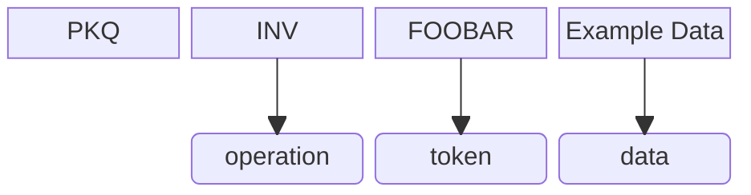
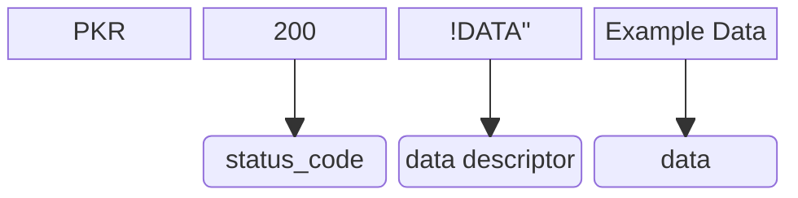

### PK 指令

PK 指令是一种基于 ASCII 文本的、应用场景灵活广泛的轻量级数据交换格式。它以简洁、高效和人类可读的方式，实现了设备之间的变量设置与读取、函数调用以及分段数据传输等功能。

---

#### 概览

PK 指令的主要功能包括：

1. **目标设备上变量的设置和读取**  
   这些变量由 PK 解释器管理，支持通过指令直接操作。

2. **带/不带参数地调用函数**  
   类似于触发事件，允许用户定义方法并动态调用。

3. **分段数据传输**  
   适用于大容量数据或受限传输环境下的高效数据交换。

---

#### 详解

PK 指令具有类似 HTTP 报文的请求-回应结构，基于“指令链”实现数据存取。为方便解析和使用，我们对术语定义如下：

- **指令链**：在一次完整的事件处理和数据交换过程中产生的所有 PK 指令。
- **请求指令 (Q)**：主动请求方发送的指令。
- **回应指令 (R)**：被动接收方返回的指令。

---

### 指令链

指令链是 PK 数据交换的核心单位，其结构分为两部分：

1. **请求部分**
   - 每个指令链总是以一个请求指令开始。
   - 请求部分仅包含一个请求指令，并且只能携带少量数据（具体限制取决于传输隧道的能力）。

2. **回应部分**
   - 指令链中除去第一个请求指令的部分即为回应部分。
   - 回应部分可能包含多个回应指令和请求指令，用于传输大量数据。

<table>
<tr>  
<td><b>注意</b></td>  
<td>不同于请求部分（仅含一个请求指令），回应部分可以包含多个请求指令和回应指令。这种设计是为了适应单次传输数据长度受限的情况，因此建议不要在请求部分中包含大量数据。</td>  
</tr>
</table>

---

### 请求部分

PK 指令的请求部分标志着一次数据传输的开始和事件的触发。其基本格式如下：

```
PKQ[Command] [Name] [Data]
```

示例：
```
PKQINV FOOBAR Example Data
```

- **PKQ**：标识这是一个 PK 请求指令。
- **[Command]**：指定的操作类型，例如 `INV` 表示调用方法。
- **[Name]**：操作的目标对象（如方法名或变量名）。
- **[Data]**：（可选）传递给操作的参数。

**可视化说明**：


---

### 回应部分

PK 指令的回应部分承担主要的数据传输工作。其基本格式如下：

```
PKR[Status] [Index]DATA[Total] [Data]
```

示例：
```
PKR200 !DATA" Example Data
```

- **PKR**：标识这是一个 PK 回应指令。
- **[Status]**：状态码，类似于 HTTP 状态码。
- **[Index]DATA[Total]**：数据描述符，表示当前指令传输的是总数据中的第几部分。例如：
  - `!DATA!` → 0 of 0，无数据传输。
  - `!DATA"` → 0 of 1，正在传输第 1 个（共 1 个）。
  - `"DATA$` → 1 of 3，正在传输第 2 个（共 3 个）。
- **[Data]**：实际传输的数据内容。

**可视化说明**：


---

### 示例 PK 指令链

#### 带有常规参数的 PK 指令链
```
-> PKQINV FOOBAR Example Data
<- PKR100 !DATA$ response part 0
-> PKQCTN "DATA$
<- PKR100 "DATA$ response part 1
-> PKQCTN #DATA$
<- PKR200 #DATA$ response part 2
-> PKQEND STATUS 200
```

#### 带有大参数的 PK 指令链
```
-> PKQSDL VARIAB #
<- PKR100 !DATA!
<- PKQGSD VARIAB
-> PKR100 !DATA# data part 0
<- PKQCTN "DATA#
-> PKR200 "DATA# data part 1
<- PKQEND STATUS 200
```

---

### 大参数机制

当指令需要传输大参数时，PK 协议采用以下机制：

1. 调用方（S）告知被调用方（R）“将要发送大参数”。
2. R 方反向发送请求指令，使用 `GSD` 方法获取大参数。
3. 如果是 `INL` 指令，则可能有返回值，此时 R 方用 `PKQEND STATUS 100` 声明。
4. 如果 S 接收到 `PKQEND STATUS 100`，则再次反转角色，发送请求指令 `GRS` 方法。

---

### 指令列表

| 指令 | 描述 |
|------|------|
| **INV** | 调用目标设备上注册的方法。<br>`Name`: 方法名称；`Data`: 调用参数 |
| **INL** | 使用大参数形式调用方法。<br>`Name`: 方法名称；`Data`: 数据数目 |
| **SND** | 设置目标设备上的变量。<br>`Name`: 变量名称；`Data`: 数据 |
| **SDL** | 使用大参数形式设置变量。<br>`Name`: 变量名称；`Data`: 数据数目 |
| **GET** | 获取目标设备上的变量。<br>`Name`: 变量名称；`Data`: 忽略 |
| **GSD** | 用于大参数交流时，被调用方获取大参数。<br>`Name`: 变量/方法名称 |
| **GRS** | 用于调用 `INL` 方法时返回值。<br>`Name`: 方法名称 |
| **END** | 当前指令链结束。<br>`Name` 只能为 `STATUS`；`Data` 是状态码。<br>特殊地，`PKQEND STATUS 100` 指示 `INL` 命令即将传回返回值 |
| **CTN** | 用于接受数据时指示继续传输。<br>`Name`: 接下来要接收的数据参数；`Data`: 忽略 |

---

### 状态码列表

| 状态码 | 描述 |
|--------|------|
| **100 Continue** | 数据传输未结束 |
| **200 OK** | 操作成功 |
| **400 Bad Request** | 目标设备的 PK 解释器无法解析指令 |
| **404 Not Found** | 变量或方法名未找到 |
| **405 Not Allowed** | 违背 PK 规则（如指令链终止前转换角色等） |
| **500 Internal Error** | 目标设备内部出错 |

---

### 总结

PK 指令以其轻量级、灵活性和高效性，成为一种理想的数据交换格式。无论是简单的变量操作还是复杂的大参数传输，PK 指令都能提供清晰的语法规则和强大的功能支持。未来，随着更多应用场景的拓展，PK 指令有望进一步优化和完善，为设备间通信带来更多可能性。
