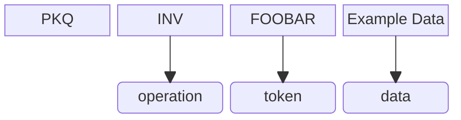
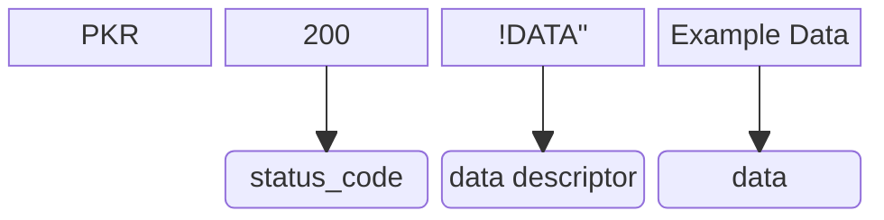

# PK 指令

PK 指令是一种基于 ASCII 文本的、应用场景灵活广泛的轻量的数据交换格式。

## 概览

PK 指令可以以轻量、简便、人类可读的方式实现

1. 目标设备上变量的设置和读取（这些变量由 PK 解释器管理）
2. 带/不带参数地调用函数（类似触发事件）
3. 分段数据传输

## 详解

PK 指令有类似 HTTP 报文的**请求-回应**结构，基于**指令链**结构实现数据存取。为方便解析和使用，我们对术语定义如下：

- **指令链**：在一次完整的事件处理和数据交换的过程中产生（交换）的所有 PK 指令。
- **请求指令** (Q)：主动请求的一方所发送的指令。
- **回应指令** (R)：被动接受的一方所发送的指令。

### 指令链

指令链是在一次完整的事件处理和数据交换的过程中产生（交换）的所有 PK 指令。一个指令链总是以请求指令开始，回应指令结束。  
一个指令链可以分成两部分：

- 请求部分：指令链总是以请求开始。请求部分只包含**一个**请求指令，仅可以携带少量数据（这取决于数据传输隧道的限制）。
- 回应部分：指令链的余下部分都是回应。回应部分可能包含若干个回应指令和请求指令，可以传输大量数据。

<table><tr>
<td><b>注意</b></td>
<td>和请求部分（仅含一个请求指令）不同，指令链的回应部分可以包括多个请求指令和回应指令，这是为传输大量数据设计的，主要针对传输隧道限制较大（单次传输的数据长度）的情况。也因此，不宜在请求部分中包含大量数据。</td>
</tr></table>

### 请求部分

PK 指令的请求部分是每个指令链的开端，标记一次数据传输的开始和事件的触发。请求指令格式如下：

```
PKQINV FOOBAR Example Data
```


* `PKQ`：PK 指令应以 PK 开头。Q 代表是请求指令。
* `INV`：这里指调用的操作。PK 请求指令允许的操作会列举在下面。
* `FOOBAR`：这里指操作的对象（token）。
* `Example Data`：（可选）这里指对操作传入的参数。

### 回应部分
PK 指令的回应部分是指令链中除去第一个请求指令的余下部分。承担着主要的数据传输工作。

#### 回应指令
回应指令的格式如下：
```
PKR200 !DATA" Example Data
```

<ul>
<li> <code>PKR</code>：PK 指令应以 PK 开头。Q 代表是回应指令。</li>
<li> <code>200</code>：状态码。PK 指令的状态码简化自 HTTP，下面会有一份完整列表。</li>
<li> <code>!DATA&quot;</code>：数据描述符。它描述了本次传输携带的数据量（当前指令链总共要传输的数据）和当前指令携带的数据。<code>!</code> 和 <code>"</code> 分别表示数字 1 和 2，这遵循 ASCII 表，用实际代表的数字 + <code>0x21</code> 作为编码值。<br>其中，<code>nDATAm</code> 代表当前指令传输的数据是<code>总共 m 个数据中的第 n 个</code>。例如，<br>
<pre><code>!DATA! --> 0 of 0，本次没有数据传输
!DATA" --> 0 of 1，正在传输第 1 个（共 1 个）
"DATA$ --> 1 of 3，正在传输第 2 个（共 3 个）
</code></pre></li>
<li><code>Example Data</code>：本次携带的数据。</li>
</ul>
  
(to be continued)