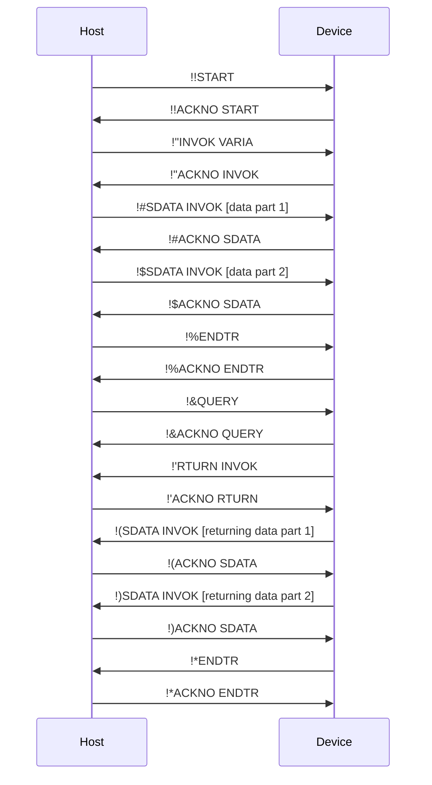
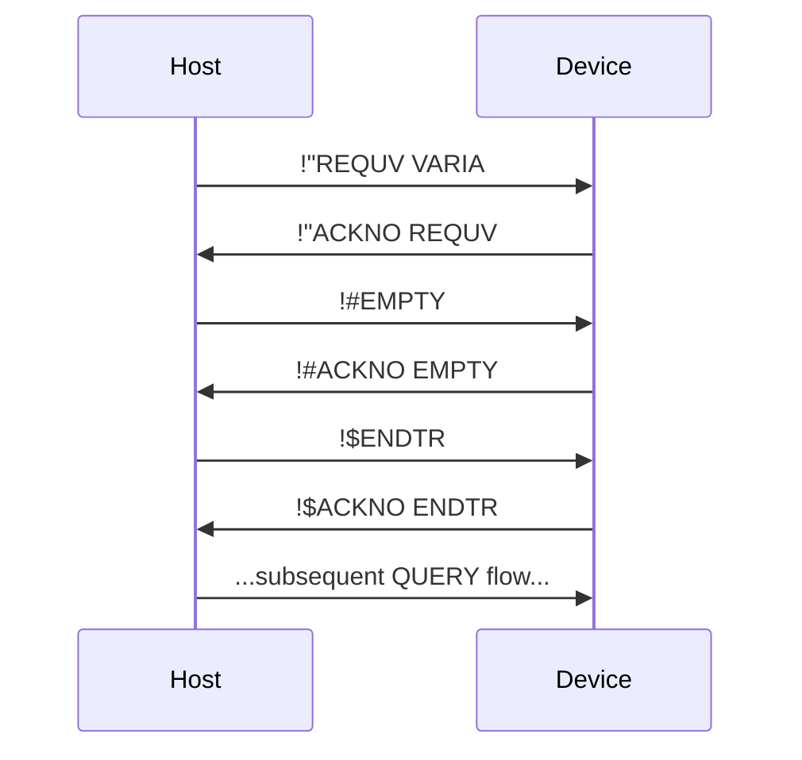
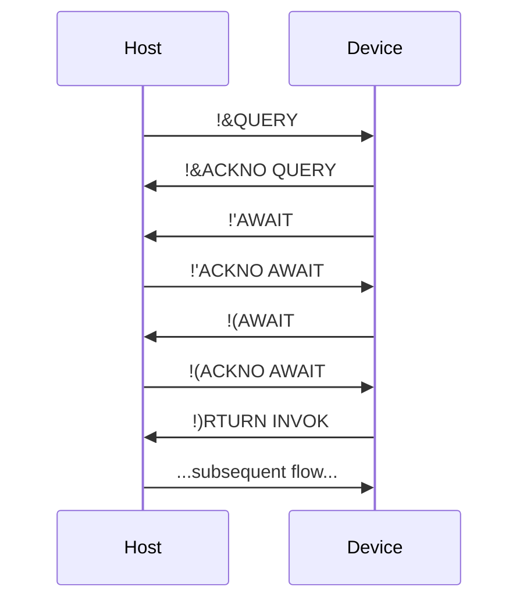

<!-- markdownlint-disable MD040 -->
# PK Command Protocol Specification

## 1. Overview

### 1.1. Introduction

The PK Command Protocol is a lightweight data transfer protocol designed for reliable communication over constrained channels. It is primarily intended for communication scenarios between a host (e.g., a PC or microcontroller) and an embedded device.

### 1.2. Design Goals

This protocol is designed to meet the requirements of the following specific channel environments and application needs:

* **Adaptability to Constrained Channels**: The protocol is optimized for channels with low bandwidth and small packet sizes (e.g., HID).
* **Point-to-Point Stability**: The communication model is based on a stable connection between two fixed endpoints (a Host and a Device).
* **Built-in Reliability**: The protocol includes a lightweight acknowledgment (ACK) and retransmission mechanism to handle packet loss on unreliable channels.
* **Simplified Security Model**: The protocol assumes the physical channel or the underlying transport layer is secure. It does not handle encryption or authentication, thereby reducing implementation complexity.
* **Comprehensive Control Capabilities**: The protocol provides mechanisms for variable access and method invocation (`INVOK`), aiming to serve as the sole control channel from the host to the device for complex device management tasks.

## 2. Core Concepts

### 2.1. Roles

* **Host**: The initiator of a transaction, actively sending commands to the device to perform operations.
* **Device**: The receiver and executor of a transaction, responding to the host's commands and returning results.

> **Note**: For clarity in describing data flow, this document also uses "Sender" and "Receiver" to refer to the originator and recipient of a specific packet.

### 2.2. Transaction Chain

A **Transaction Chain** (or simply a **Chain**) is the complete sequence of command exchanges involved in a single, complete operation (e.g., setting a variable).

* **Root Operation**: The core operation that drives the entire transaction chain, such as `SENDV` or `INVOK`.
* **Sub-Operation**: An auxiliary operation performed to complete the root operation, such as `SDATA` or `ACKNO`.

### 2.3. Operation

An operation is the specific action performed by a command. Each operation consists of three elements:

| Element | Description |
| :---: | --- |
| **Name** | The identifier of the operation, defining the command's behavior (analogous to an HTTP method). |
| **Object** | The target that the operation acts upon (analogous to an HTTP path). |
| **Data** | The payload of the operation, such as parameters or return values (analogous to an HTTP request body). |

## 3. Protocol Format

### 3.1. Command Structure

Every PK command adheres to the following fixed structure:

```
[MSG ID][OPERATION NAME] [OBJECT] [DATA]
```

The fields are defined as follows:

| Field | Length (chars) | Description | Mandatory |
| :---: | :---: | --- | :---: |
| `MSG ID` | 2 | **Message ID**. Used for command tracking and the acknowledgment mechanism. | Yes |
| `OPERATION NAME` | 5 | **Operation Name**. | Yes |
| `OBJECT` | 5 | **Operation Object**. | No |
| `DATA` | Variable | **Operation Data**. | No |

**Formatting Constraints**:

* All fields except `DATA` have a fixed length to simplify parsing.
* The `OBJECT` field is mandatory if the `DATA` field is present.
* The length of the `DATA` field is determined by the underlying transport protocol's packet capacity minus 14 bytes (for `MSG ID`, `OP NAME`, `OBJECT`, and two spaces).

### 3.2. Message ID

The `MSG ID` is a 2-character string representing a number in a base-94 counting system.

* **Character Set**: Uses printable ASCII characters from `0x21` (`!`) to `0x7E` (`~`).
* **Encoding**: The two characters `c1` and `c2` are converted to an integer `ID` using the formula:
    `ID = (c1 - 0x21) * 94 + (c2 - 0x21)`
* **Value Range**: The ID ranges from `0` (`!!`) to `8835` (`~~`).
* **Rollover Mechanism**: The ID increments after each successful exchange (command sent and valid ACK received). When the ID reaches `8835`, it rolls over to `0` on the next increment.
* **Scope**: The `MSG ID` **accumulates across chains** throughout the session and is not reset by an `ENDTR` command.

## 4. Transaction Flow

### 4.1. Typical Transaction Sequence Diagram

The following diagram illustrates a typical transaction flow that includes both inbound and outbound data.



### 4.2. Chain Initiation and Termination

* **Initiation**: The Host initiates a new transaction chain by sending a `START` command.
* **Termination**: After all data exchange (both inbound and outbound) is complete, the party that sent the last data packet terminates the entire chain with an `ENDTR` command.

### 4.3. Data Transfer

The root operation command itself does not carry data. Data is transferred using dedicated sub-operations.

#### 4.3.1. Inbound Data (Host -> Device)

1. The Host sends the root operation command (e.g., `SENDV`).
2. After the Device acknowledges it, the Host sends the data in one or more `SDATA` command chunks. The `OBJECT` of the `SDATA` command must be the name of the root operation.
3. Once all data has been sent, the Host sends an `ENDTR` command to signal the end of the inbound phase.

#### 4.3.2. Outbound Data (Device -> Host)

1. After the inbound phase is complete, the Host sends a `QUERY` command to request outbound data.
2. The Device responds to the `QUERY` with an `RTURN` command:
    * If there is data to return, the `OBJECT` of `RTURN` is the name of the root operation (e.g., `REQUV`).
    * If there is no data to return, the `OBJECT` of `RTURN` is `EMPTY`.
3. If there is data, the Device sends it in one or more `SDATA` command chunks.
4. Once all data has been sent, the Device sends an `ENDTR` command, signaling the end of the outbound phase and the entire transaction chain.

#### 4.3.3. Transactions without Inbound Data

For operations with no inbound data (e.g., `REQUV`), the Host, after sending the root command and receiving its acknowledgment, must immediately send an `EMPTY` command, followed by an `ENDTR` to conclude the inbound phase.



### 4.4. Acknowledgment and Retransmission Mechanism (ACK)

To ensure reliable transmission, the protocol uses a request-response mechanism.

* **Acknowledgment Command**: The receiver of any command (except for `ACKNO` itself) **must** reply with an `ACKNO` command.
* **Format**: `[MSG ID]ACKNO [OP_NAME]`
  * `MSG ID`: Must be identical to the `MSG ID` of the command being acknowledged.
  * `OP_NAME`: Must be identical to the `OPERATION NAME` of the command being acknowledged.
* **Validation**: Upon receiving an `ACKNO`, the sender must validate that its `MSG ID` and `OP_NAME` match. A mismatch should be treated as a transmission failure, and the current chain should be terminated.
* **Timeout and Retransmission**: If a sender does not receive a valid `ACKNO` within a specified timeout period, it should retransmit the last command (using the same `MSG ID`). The receiver can use the `MSG ID` to distinguish between a retransmitted packet and a new one.

### 4.5. Long-Running Operations

When a device is executing a time-consuming operation (e.g., `INVOK`ing a method), it should periodically send `AWAIT` commands to prevent a host-side timeout and maintain the connection's active state (Keep-alive). The host must respond to each `AWAIT` with a standard `ACKNO`.



## 5. Error Handling

When an unrecoverable error occurs during protocol execution (e.g., command parsing failure, non-existent object), the party that detects the error should send an `ERROR` command.

* **Command Format**: `ERROR ERROR [description]`
  * `MSG ID`: Fixed as two space characters (`0x20 0x20`).
  * `OPERATION NAME` and `OBJECT`: Fixed as `ERROR`.
  * `DATA`: A short error description in English.
* **Acknowledgment**: The `ERROR` command must also be acknowledged with an `ACKNO`. The `MSG ID` of its `ACKNO` is also fixed as two spaces. If the `ACKNO` times out, the `ERROR` command should be retransmitted.
* **Consequences**: Once an `ERROR` command is sent or received, the current transaction chain is immediately invalidated. Both parties should abort the current operation and prepare to start a new transaction chain.

> **Design Constraint**: The protocol's error handling mechanism is fundamental and primarily intended for handling incidental runtime errors. It assumes that all foreseeable, non-incidental logical errors are identified and resolved during development.

## 6. Operation Command Set

| Name | Root Op. | Description | Object | Inbound Data | Outbound Data |
| :---: | :---: | --- | :---: | :---: | :---: |
| `SENDV` | Yes | Sets a variable on the device. | Variable name | Serialized content of the variable | None |
| `REQUV` | Yes | Requests the value of a variable from the device. | Variable name | None | Serialized content of the variable |
| `INVOK` | Yes | Invokes a method on the device. | Method name | Parameters for the method | Return value of the method |
| `PKVER` | Yes | Gets the version of the PK protocol interpreter on the device. | None | None | Version string |
| `START` | No | Initiates a new transaction chain. | None | None | None |
| `ENDTR` | No | Ends a data transfer phase or the entire chain. | None | None | None |
| `ACKNO` | No | Acknowledges receipt of a command. | Name of the ack'd command | None | None |
| `QUERY` | No | Requests outbound data from the device. | None | None | None |
| `RTURN` | No | Indicates whether outbound data exists. | Root op. name or `EMPTY` | None | None |
| `EMPTY` | No | Indicates that the current transfer phase has no data. | None | None | None |
| `SDATA` | No | Sends a chunk of data. | Name of the root operation | Data chunk | None |
| `AWAIT` | No | Keeps the connection alive during long operations. | None | None | None |
| `ERROR` | N/A | Reports a critical error. | `ERROR` | Error description | None |

## Appendix A: Timing Recommendations

This protocol does not enforce specific timeout values, but for interoperability, the following are recommended for implementation:

* **ACK Timeout**: 100 ms
* **Inter-command Timeout**: 500 ms
* **AWAIT Interval**: 300 ms
