# PK Command Protocol Specification

## 1. Overview

### 1.1. Introduction

The PK Command Protocol is a lightweight data transfer protocol designed for reliable communication over constrained channels. It is primarily intended for communication scenarios between a host (e.g., a PC) and an embedded device.
The reference implementation of this protocol is available in the [PK-Command Rust Library](https://crates.io/crates/pk-command).

### 1.2. Design Goals

This protocol is designed to meet the requirements of the following specific channel environments and application needs:

- **Adaptability to Constrained Channels**: The protocol is optimized for channels with low bandwidth and small packet sizes (e.g., HID).
- **Point-to-Point Stability**: The communication model is based on a stable connection between two fixed endpoints (a Host and a Device).
- **Built-in Reliability**: The protocol includes a lightweight acknowledgment (ACK) and retransmission mechanism to handle packet loss on unreliable channels.
- **Simplified Security Model**: The protocol assumes the physical channel or the underlying transport layer is secure. It does not handle encryption or authentication, thereby reducing implementation complexity.
- **Comprehensive Control Capabilities**: The protocol provides mechanisms for variable access and method invocation (`INVOK`), aiming to serve as the sole control channel from the host to the device for complex device management tasks.

### 1.3. Versioning

This document describes **Version 1** of the PK Command Protocol.

The PK Command interpreter’s version (retrievable via the `PKVER` command) must adhere to the Semantic Versioning (SemVer) specification in the format `a.b.c` (e.g., `1.2.0`). The version components are interpreted as follows:

- **`a` (Major)**: Represents the **Protocol Version**. This number must match the version of the PK Command Protocol specification that the interpreter implements. It increments only when the supported protocol version is updated, regardless of API changes in the library itself.
- **`b` (Minor)** and **`c` (Patch)**: Represent the **Library Version**. These numbers follow standard SemVer rules to denote feature updates and bug fixes within the implementation of the specified protocol version.

## 2. Core Concepts

### 2.1. Roles

- **Host**: The initiator of a transaction, actively sending commands to the device to perform operations.
- **Device**: The receiver and executor of a transaction, responding to the host's commands and returning results.

> **Note**: For clarity in describing data flow, this document also uses "Sender" and "Receiver" to refer to the originator and recipient of a specific packet.

### 2.2. Transaction Chain

A **Transaction Chain** (or simply a **Chain**) is the complete sequence of command exchanges involved in a single, complete operation (e.g., setting a variable).

- **Root Operation**: The core operation that drives the entire transaction chain, such as `SENDV` or `INVOK`.
- **Sub-Operation**: An auxiliary operation performed to complete the root operation, such as `SDATA` or `ACKNO`.

### 2.3. Operation

An operation is the specific action performed by a command. Each operation consists of three elements:

| Element | Description |
| :---: | --- |
| **Name** | The identifier of the operation, defining the command's behavior (analogous to an HTTP method). |
| **Object** | The target that the operation acts upon (analogous to an HTTP path). |
| **Data** | The payload of the operation, such as parameters or return values (analogous to an HTTP request body). |

## 3. Protocol Format

### 3.1. Command Structure

Every PK command adheres to the following fixed structure:

```
[MSG ID][OPERATION NAME] [OBJECT] [DATA]
```

The fields are defined as follows:

| Field | Length (chars) | Description | Mandatory |
| :---: | :---: | --- | :---: |
| `MSG ID` | 2 | **Message ID**. Used for command tracking and the acknowledgment mechanism. | Yes |
| `OPERATION NAME` | 5 | **Operation Name**. | Yes |
| `OBJECT` | 5 | **Operation Object**. | No |
| `DATA` | Variable | **Operation Data**. | No |

**Formatting Constraints**:

- All fields except `DATA` have a fixed length to simplify parsing.
- The `OBJECT` field is mandatory if the `DATA` field is present.
- The length of the `DATA` field is determined by the underlying transport protocol's packet capacity minus 14 bytes (for `MSG ID`, `OP NAME`, `OBJECT`, and two spaces).

### 3.2. Message ID

The `MSG ID` is a 2-character string representing a number in a base-94 counting system.

- **Character Set**: Uses printable ASCII characters from `0x21` (`!`) to `0x7E` (`~`).
- **Encoding**: The two characters `c1` and `c2` are converted to an integer `ID` using the formula:
    `ID = (c1 - 0x21) * 94 + (c2 - 0x21)`
- **Value Range**: The ID ranges from `0` (`!!`) to `8835` (`~~`).
- **Rollover Mechanism**: The ID increments after each successful exchange (command sent and valid ACK received). When the ID reaches `8835`, it rolls over to `0` on the next increment.
- **Scope**: The `MSG ID` **accumulates across chains** throughout the session and is not reset by an `ENDTR` command.

#### 3.2.1. MSG ID Increment Rules

When a party needs to send a new command (not an `ACKNO`), the `MSG ID` is calculated as:

```
New MSG ID = (Last received command's MSG ID + 1) mod 8836
```

Meanwhile, `Last received command's MSG ID + 1` is equivalent to `Last acknowledged command's MSG ID + 1`.

Since every non-`ACKNO` command requires an acknowledgment, this ensures both parties maintain synchronized MSG ID expectations.

> **Note**: The `ACKNO` command always echoes the exact `MSG ID` of the command it acknowledges; it does not increment the ID.

## 4. Transaction Flow

A complete transaction chain consists of four sequential phases. Each phase must be fully completed before the next one begins.

|Phase| Name | Description | Initiator |
|:-:| :--- | --- | :---: |
|1| **Initiation** | Establish a new transaction chain. | Host |
|2| **Root Operation Assignment** | Declare the operation to be performed. | Host |
|3| **Inbound Data Transfer** | Transfer parameters from Host to Device (may be empty). | Host |
|4| **Outbound Data Transfer** | Transfer results from Device to Host (may be empty). | Host initiates with `QUERY`, Device responds |

### 4.1. Transaction Chain Structure

The following diagram illustrates the complete structure of a transaction chain:

```
┌─────────────────────────────────────────────────────────────────────────────┐
│                           TRANSACTION CHAIN                                 │
├─────────────┬─────────────────┬─────────────────────┬───────────────────────┤
│  Phase 1    │    Phase 2      │      Phase 3        │       Phase 4         │
│ Initiation  │  Root Op Assign │  Inbound Transfer   │   Outbound Transfer   │
├─────────────┼─────────────────┼─────────────────────┼───────────────────────┤
│   START     │   <ROOT OP>     │  SDATA.../EMPTY     │  QUERY                │
│   ↓ ACK     │   ↓ ACK         │  ↓ ACK (each)       │  ↓ ACK                │
│             │                 │  ENDTR              │  [AWAIT...]*          │
│             │                 │  ↓ ACK              │  RTURN                │
│             │                 │                     │  ↓ ACK                │
│             │                 │                     │  SDATA... (if any)    │
│             │                 │                     │  ↓ ACK (each)         │
│             │                 │                     │  ENDTR                │
│             │                 │                     │  ↓ ACK                │
└─────────────┴─────────────────┴─────────────────────┴───────────────────────┘
                                                        * AWAIT is optional
```

### 4.2. Phase 1: Initiation

Every transaction chain **must** begin with a `START` command from the Host.

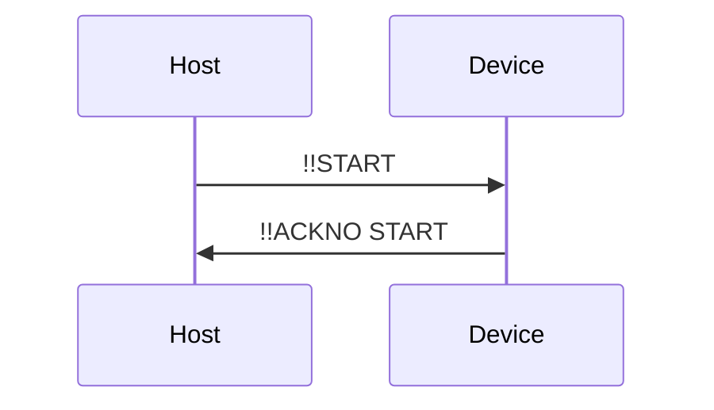

### 4.3. Phase 2: Root Operation Assignment

After receiving the `ACKNO` for `START`, the Host sends the root operation command. This declares the intent of the transaction.

The four root operations are:

| Operation | Object | Purpose |
| :---: | :---: | --- |
| `SENDV` | Variable name | Set a variable on the Device |
| `REQUV` | Variable name | Request a variable's value from the Device |
| `INVOK` | Method name | Invoke a method on the Device |
| `PKVER` | *(none)* | Query the PK Command interpreter version on the Device |

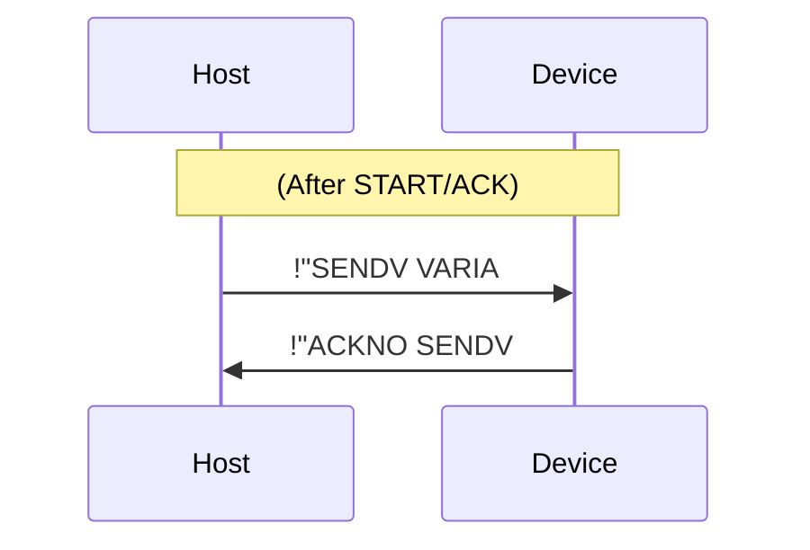

### 4.4. Phase 3: Inbound Data Transfer (Host → Device)

After the root operation is acknowledged, the Host transfers parameter data (if any) to the Device, or claims that no parameter is to be sent.

#### 4.4.1. With Inbound Data

If there is data to send, the Host sends one or more `SDATA` commands, each carrying a chunk of the data. The `OBJECT` field of `SDATA` **must** be the name of the root operation.

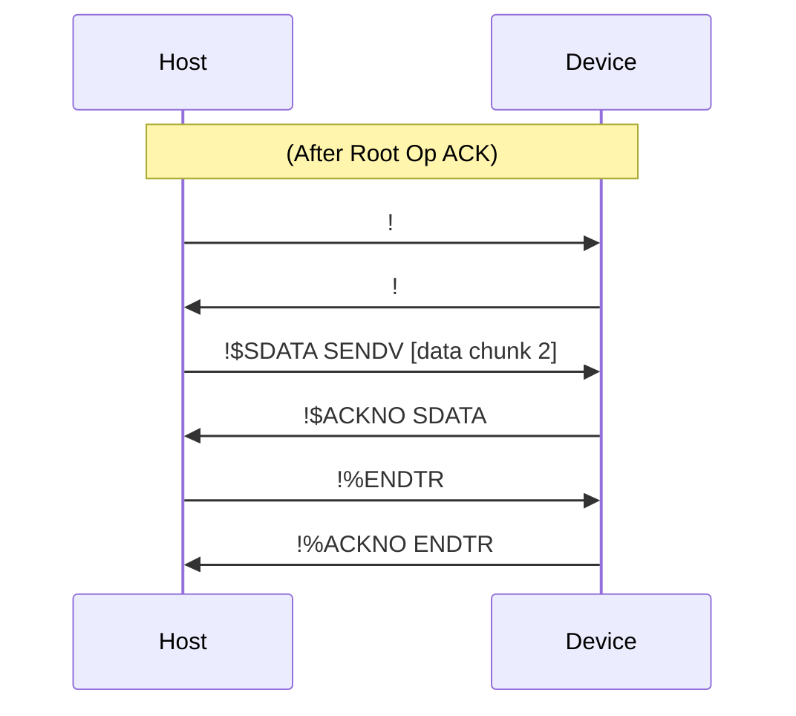

#### 4.4.2. Without Inbound Data

If there is no data to send (e.g., for `REQUV` or `PKVER`), the Host **must** send an `EMPTY` command followed by `ENDTR`.

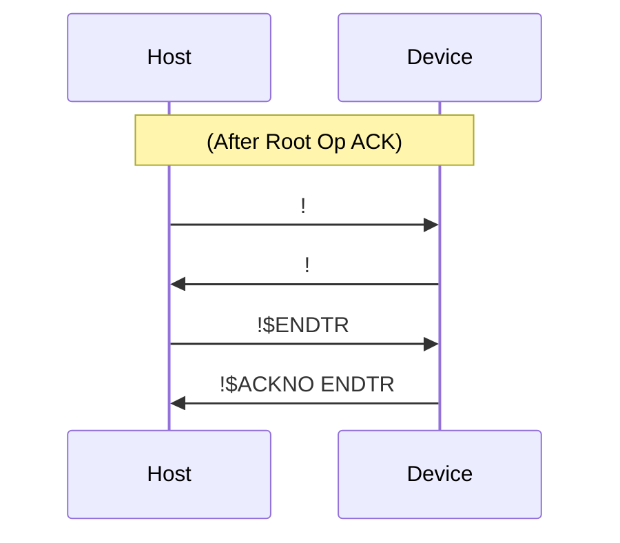

> **Important**: The `EMPTY` command is mandatory when there is no data. It explicitly signals the absence of inbound data and ensures the phase structure is consistent.

### 4.5. Phase 4: Outbound Data Transfer (Device → Host)

After the inbound phase completes, the Host sends a `QUERY` command to request results from the Device.

#### 4.5.1. Device Processing and Keep-Alive

Upon receiving `QUERY`, the Device begins processing the requested operation. If processing takes a long time, the Device should periodically send `AWAIT` commands to keep the connection alive.

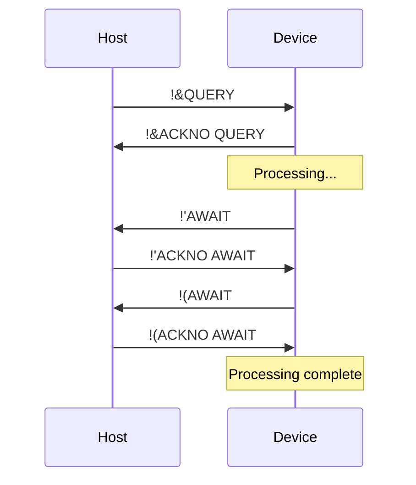

#### 4.5.2. Returning Data with RTURN

Once processing is complete, the Device sends a `RTURN` command:

- **With data**: `RTURN <ROOT_OP_NAME>` — The `OBJECT` is the name of the root operation (e.g., `REQUV`, `INVOK`, `PKVER`).
- **Without data**: `RTURN EMPTY` — The `OBJECT` is literally `EMPTY`.

Example (with outbound data):

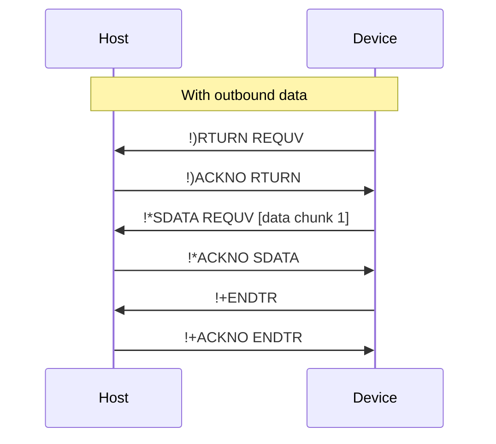

Example (without outbound data):

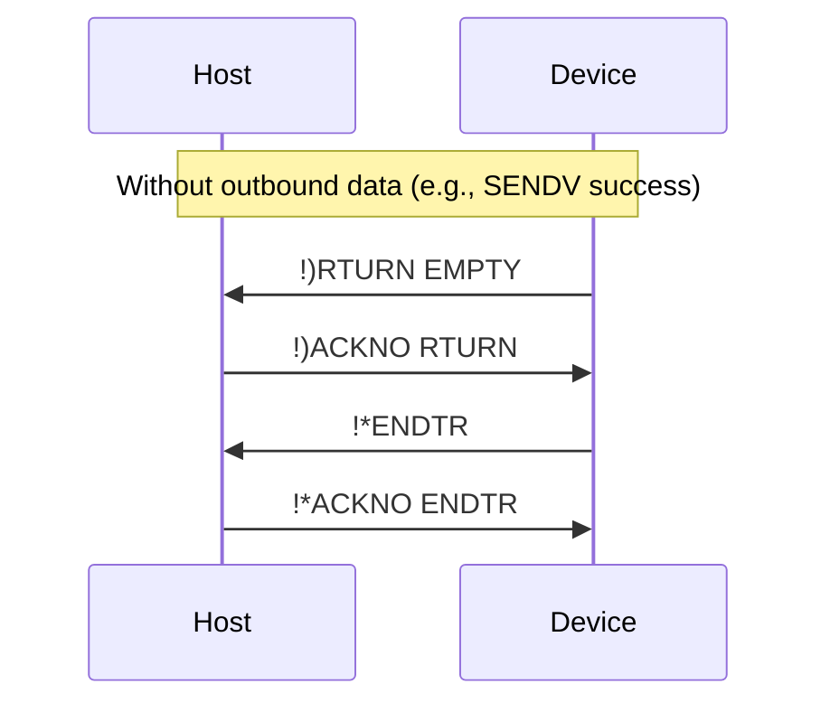

> **Note**: For `SDATA` commands in the outbound phase, the `OBJECT` is also the root operation name.

### 4.6. Complete Transaction Examples

#### 4.6.1. REQUV (Request Variable) — No inbound, has outbound

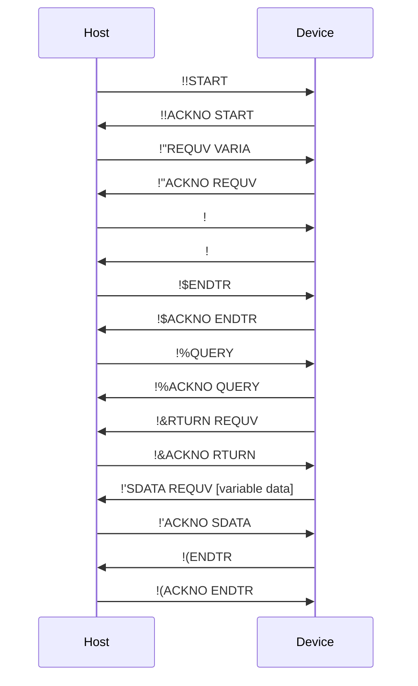

#### 4.6.2. SENDV (Send Variable) — Has inbound, no outbound

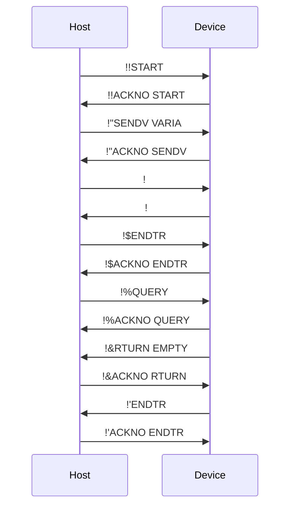

#### 4.6.3. INVOK (Invoke Method) — Has inbound, has outbound, with AWAIT

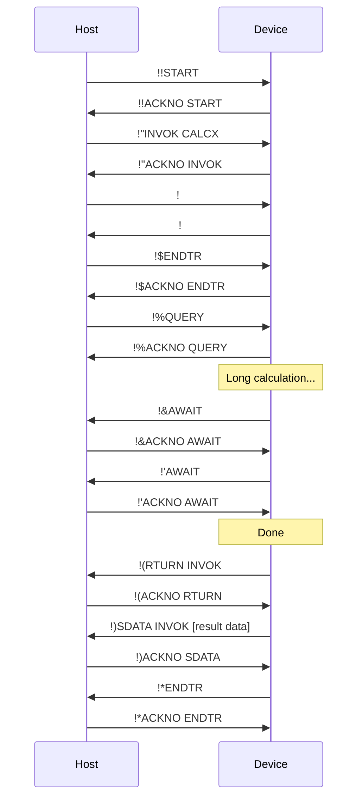

#### 4.6.4. PKVER (Get Protocol Interpreter Version) — No inbound, has outbound, no object

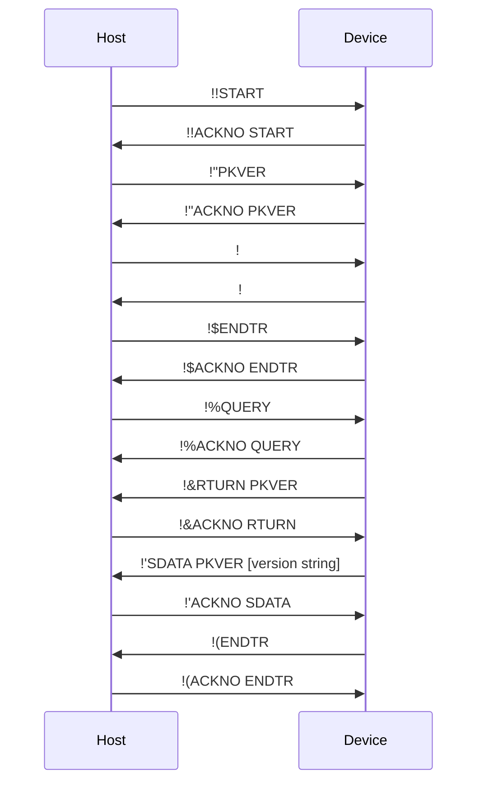

### 4.7. Acknowledgment and Retransmission Mechanism

To ensure reliable transmission, the protocol uses a request-response mechanism.

#### 4.7.1. Acknowledgment Rules

- **Mandatory Response**: The receiver of any command (except `ACKNO` itself) **must** reply with an `ACKNO` command.
- **Format**: `[MSG ID]ACKNO [OP_NAME]`
  * `MSG ID`: Must be identical to the `MSG ID` of the command being acknowledged.
  * `OP_NAME`: Must be identical to the `OPERATION NAME` of the command being acknowledged.

#### 4.7.2. Validation

Upon receiving an `ACKNO`, the sender must validate that its `MSG ID` and `OP_NAME` match the sent command. A mismatch should be treated as a transmission failure, and the current chain should be terminated with an `ERROR`.

#### 4.7.3. Timeout and Retransmission

If a sender does not receive a valid `ACKNO` within a specified timeout period, it should retransmit the last command using the **same** `MSG ID`. The receiver can use the `MSG ID` to detect and handle duplicate packets.

## 5. Error Handling

When an unrecoverable error occurs during protocol execution (e.g., command parsing failure, non-existent object), the party that detects the error should send an `ERROR` command.

### 5.1. ERROR Command Format

```
  ERROR ERROR [description]
```

- `MSG ID`: Fixed as two space characters (`0x20 0x20`).
- `OPERATION NAME`: Fixed as `ERROR`.
- `OBJECT`: Fixed as `ERROR`.
- `DATA`: A short error description in English.

### 5.2. ERROR Acknowledgment

The `ERROR` command must be acknowledged with:

```
  ACKNO ERROR
```

The `MSG ID` is also fixed as two space characters. If the `ACKNO` times out, the `ERROR` command should be retransmitted.

### 5.3. Consequences

Once an `ERROR` command is sent or received, the current transaction chain is immediately invalidated. Both parties should:

1. Abort the current operation.
2. Reset their internal state.
3. Be ready to start a new transaction chain.

> **Warning**: The protocol's error handling mechanism is fundamental and primarily intended for handling incidental runtime errors. It assumes that all foreseeable, non-incidental logical errors are identified and resolved during development.

## 6. Operation Reference

### 6.1. Root Operations

Root operations initiate the purpose of a transaction chain. They are sent by the Host during Phase 2.

| Name | Object | Has Inbound Data | Has Outbound Data | Description |
| :---: | :---: | :---: | :---: | --- |
| `SENDV` | Variable name | Yes | No | Sets a variable on the device |
| `REQUV` | Variable name | No | Yes | Requests a variable's value |
| `INVOK` | Method name | Yes* | Yes* | Invokes a method on the device |
| `PKVER` | *(none)* | No | Yes | Gets the PK interpreter version on the other side (See [1.3. Versioning](#13-versioning)) |

\* `INVOK` may or may not have inbound/outbound data depending on the method.

### 6.2. Sub-Operations

Sub-operations are auxiliary commands used within the transaction phases.

| Name | Object | Data | Description |
| :---: | :---: | :---: | --- |
| `START` | *(none)* | *(none)* | Initiates a new transaction chain |
| `ENDTR` | *(none)* | *(none)* | Ends a data transfer phase or the entire chain |
| `ACKNO` | Acknowledged op name | *(none)* | Acknowledges receipt of a command |
| `QUERY` | *(none)* | *(none)* | Requests outbound data from the device |
| `RTURN` | Root op name or `EMPTY` | *(none)* | Indicates whether outbound data exists |
| `EMPTY` | *(none)* | *(none)* | Indicates no data in the current transfer phase |
| `SDATA` | Root op name | Data chunk | Sends a chunk of data |
| `AWAIT` | *(none)* | *(none)* | Keep-alive during long operations |
| `ERROR` | `ERROR` | Error description | Reports a critical error |

## Appendix A: Timing Recommendations

This protocol does not enforce specific timeout values, but for interoperability, the following are recommended:

| Parameter | Recommended Value | Description |
| --- | :---: | --- |
| **ACK Timeout** | 100 ms | Time to wait for an `ACKNO` before retransmitting |
| **Inter-command Timeout** | 500 ms | Maximum idle time between commands in a chain |
| **AWAIT Interval** | 300 ms | Interval between `AWAIT` keep-alive commands |

## Appendix B: Quick Reference — Command Sequences by Operation

| Root Op | Phase 3 (Inbound) | Phase 4 (Outbound) |
| :---: | --- | --- |
| `SENDV` | `SDATA...` → `ENDTR` | `QUERY` → `RTURN EMPTY` → `ENDTR` |
| `REQUV` | `EMPTY` → `ENDTR` | `QUERY` → `RTURN REQUV` → `SDATA...` → `ENDTR` |
| `INVOK` | `SDATA.../EMPTY` → `ENDTR` | `QUERY` → `[AWAIT...]` → `RTURN INVOK/EMPTY` → `[SDATA...]` → `ENDTR` |
| `PKVER` | `EMPTY` → `ENDTR` | `QUERY` → `RTURN PKVER` → `SDATA...` → `ENDTR` |

> **Note**: All commands except `ACKNO` require an acknowledgment. The table above omits `ACKNO` for brevity.
