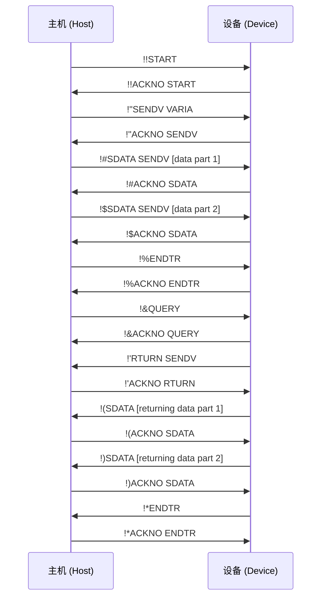
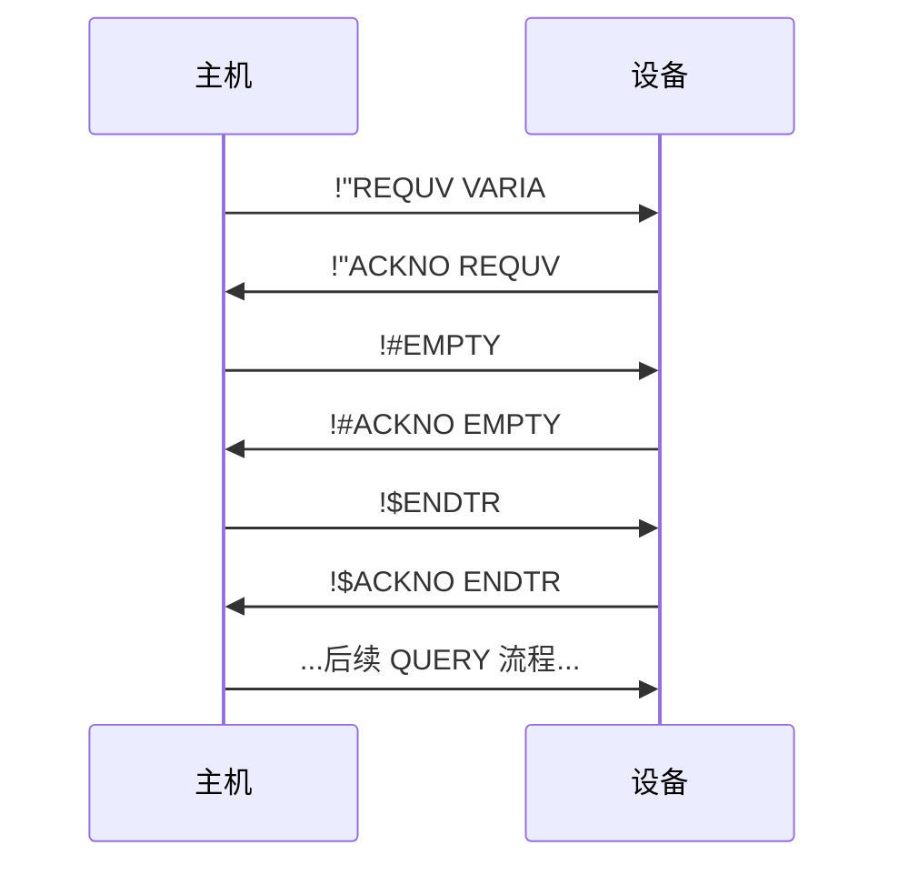
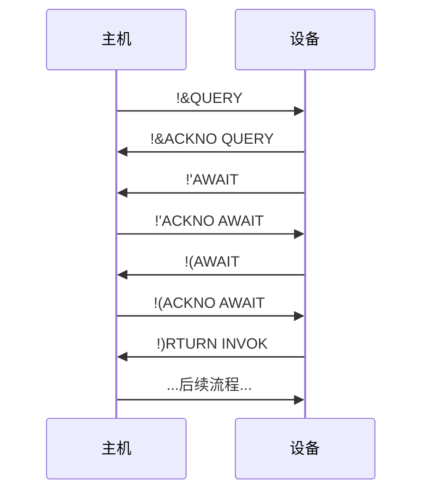

<!-- markdownlint-disable MD040 -->
# PK 指令协议规范

## 1. 概述

### 1.1. 引言

PK 指令协议是一种轻量级的数据传输协议，专为在受限信道上进行可靠通信而设计。它主要应用于主机（如 PC 或微控制器）与嵌入式设备之间的通信场景。

### 1.2. 设计目标

本协议的设计旨在满足以下特定信道环境与应用需求：

* **受限信道适应性**：协议针对低带宽、小数据包容量的信道（如 HID）进行了优化。
* **点对点稳定性**：通信模型基于两个固定设备（主机与从机）之间的稳定连接。
* **内置可靠性**：协议包含轻量级的确认（ACK）与重传机制，以应对不可靠信道中的数据包丢失问题。
* **简化安全模型**：协议假定物理信道或底层传输层是安全的，不处理加密、认证等安全问题，以降低实现复杂度。
* **全面的控制能力**：协议提供变量读写和方法调用（`INVOK`）机制，旨在成为主机端控制设备的唯一渠道，满足复杂的设备管理需求。

## 2. 核心概念

### 2.1. 角色 (Roles)

* **主机 (Host)**：事务的发起方，主动向设备发送指令以执行操作。
* **设备 (Device)**：事务的接收方与执行方，响应主机的指令并返回结果。

> **注**：在本文档中，为便于描述数据流向，也使用“发送方 (Sender)”和“接收方 (Receiver)”指代当前数据包的发送者和接收者。

### 2.2. 事务链 (Transaction Chain)

一个完整的操作（如设置变量）所涉及的所有指令交换序列，构成一个**事务链**（简称**链**）。

* **根操作 (Root Operation)**：驱动整个事务链的核心操作，如 `SENDV` 或 `INVOK`。
* **子操作 (Sub-Operation)**：为完成根操作而执行的辅助性操作，如 `SDATA`、`ACKNO` 等。

### 2.3. 操作 (Operation)

一条指令所执行的具体动作。每个操作包含以下三个要素：

| 要素 | 描述 |
| :---: | --- |
| **名称 (Name)** | 操作的标识符，定义了指令的行为（类似于 HTTP 方法）。 |
| **对象 (Object)** | 操作所作用的目标（类似于 HTTP 路径）。 |
| **数据 (Data)** | 操作的负载，如参数或返回值（类似于 HTTP 请求体）。 |

## 3. 协议格式

### 3.1. 指令结构

每条 PK 指令均遵循以下固定结构：

```
[MSG ID][OPERATION NAME] [OBJECT] [DATA]
```

指令各字段定义如下：

| 字段 | 长度 (字符) | 描述 | 强制性 |
| :---: | :---: | --- | :---: |
| `MSG ID` | 2 | **消息 ID**。用于指令追踪和确认机制。 | 是 |
| `OPERATION NAME` | 5 | **操作名称**。 | 是 |
| `OBJECT` | 5 | **操作对象**。 | 否 |
| `DATA` | 可变 | **操作数据**。 | 否 |

**格式约束**：

* 除 `DATA` 外，所有字段均为固定长度，以便于解析。
* `OBJECT` 字段在 `DATA` 字段存在时必须提供。
* `DATA` 字段的长度由底层传输协议的数据包容量减去 14 字节（`MSG ID` + `OP NAME` + `OBJECT` + 两个空格）决定。

### 3.2. 消息 ID (Message ID)

`MSG ID` 是一个长度为 2 的字符串，采用 94 进制计数系统。

* **字符集**：使用 ASCII 可打印字符，范围从 `0x21` (`!`) 到 `0x7E` (`~`)。
* **编码方式**：将两位字符 `c1` 和 `c2` 转换为一个整数 `ID` 的公式为：
    `ID = (c1 - 0x21) * 94 + (c2 - 0x21)`
* **取值范围**：ID 从 `0` (`!!`) 到 `8835` (`~~`)。
* **循环机制**：ID 在每次成功交换（发送指令并收到有效 ACK）后递增。当 ID 达到 `8835` 后，下一个 ID 将回绕至 `0`。
* **作用域**：`MSG ID` 在整个会话期间**跨链累积**，不因事务链的结束（`ENDTR`）而重置。

## 4. 事务流程

### 4.1. 典型事务序列图

下图展示了一个包含数据传入和传出的典型事务流程。



### 4.2. 链的建立与终止

* **建立**：主机通过发送 `START` 指令发起一个新的事务链。
* **终止**：当数据交换（包括传入和传出）全部完成后，最后发送数据的一方以 `ENDTR` 指令结束整个事务链。

### 4.3. 数据传输

根操作自身不携带数据。数据的传输通过专用的子操作完成。

#### 4.3.1. 传入数据 (Host -> Device)

1. 主机发送根操作指令（如 `SENDV`）。
2. 设备确认后，主机使用一条或多条 `SDATA` 指令发送数据分片。`SDATA` 的对象应设为根操作的名称。
3. 数据发送完毕后，主机发送 `ENDTR` 指令，标志着传入阶段结束。

#### 4.3.2. 传出数据 (Device -> Host)

1. 在传入阶段结束后，主机发送 `QUERY` 指令，请求传出数据。
2. 设备响应 `QUERY` 后，发送 `RTURN` 指令：
    * 若有数据返回，`RTURN` 的对象为根操作的名称（如 `REQUV`）。
    * 若无数据返回，`RTURN` 的对象为 `EMPTY`。
3. 若有数据，设备使用一条或多条 `SDATA` 指令发送数据分片。
4. 数据发送完毕后，设备发送 `ENDTR` 指令，标志着传出阶段及整个事务链的结束。

#### 4.3.3. 无传入数据的事务

对于没有传入数据的操作（如 `REQUV`），主机在发送根操作指令并收到确认后，应立即发送 `EMPTY` 指令，随后发送 `ENDTR` 结束传入阶段。



### 4.4. 确认与重传机制 (ACK)

为保证传输的可靠性，协议采用请求-应答机制。

* **确认指令**：除 `ACKNO` 自身外，任何指令的接收方都**必须**回复一条 `ACKNO` 指令。
* **格式**：`[MSG ID]ACKNO [OP_NAME]`
  * `MSG ID`：必须与被确认的指令的 `MSG ID` 完全一致。
  * `OP_NAME`：必须与被确认的指令的 `OPERATION NAME` 完全一致。
* **验证**：发送方在收到 `ACKNO` 后，必须验证其 `MSG ID` 和 `OP_NAME` 是否匹配。若不匹配，应视为传输失败并终止当前链。
* **超时与重传**：发送方在指定超时时间内未收到有效的 `ACKNO`，应重传上一条指令（使用相同的 `MSG ID`）。接收方可根据 `MSG ID` 判断是重传包还是新包。

### 4.5. 长时间操作 (Long-Running Operations)

当设备执行一个耗时较长的操作（如 `INVOK` 某个方法）时，为防止主机侧超时，设备应定期发送 `AWAIT` 指令以维持连接活跃状态（Keep-alive）。主机收到 `AWAIT` 后，需按常规流程回复 `ACKNO`。



## 5. 错误处理

当协议执行过程中发生无法恢复的错误（如指令解析失败、对象不存在等）时，检测到错误的一方应发送 `ERROR` 指令。

* **指令格式**：`ERROR ERROR [description]`
  * `MSG ID`：固定为两个空格字符 (`0x20 0x20`)。
  * `OPERATION NAME` 和 `OBJECT`：固定为 `ERROR`。
  * `DATA`：一段简短的英文错误描述。
* **确认**：`ERROR` 指令同样需要被 `ACKNO` 确认，其 `ACKNO` 的 `MSG ID` 也固定为两个空格。若 `ACKNO` 超时，`ERROR` 指令应被重传。
* **后果**：一旦 `ERROR` 指令被发送或接收，当前事务链立即作废。通信双方应中止当前操作，准备开始新的事务链。

> **设计约束**：本协议的错误处理机制是基础的，主要用于处理运行时发生的偶然性错误。协议假定，所有可预见的、非偶然性的逻辑错误应在开发阶段被发现和消除。

## 6. 操作指令集

| 名称 | 根操作 | 描述 | 对象 | 传入数据 | 传出数据 |
| :---: | :---: | --- | :---: | :---: | :---: |
| `SENDV` | 是 | 设置设备上的一个变量。 | 变量名 | 变量的序列化内容 | 无 |
| `REQUV` | 是 | 请求获取设备上的一个变量。 | 变量名 | 无 | 变量的序列化内容 |
| `INVOK` | 是 | 调用设备上的一个方法。 | 方法名 | 方法的参数 | 方法的返回值 |
| `PKVER` | 是 | 获取设备上 PK 协议解释器的版本。 | 无 | 无 | 版本号字符串 |
| `START` | 否 | 发起一个新的事务链。 | 无 | 无 | 无 |
| `ENDTR` | 否 | 结束一个数据传输阶段或整个链。 | 无 | 无 | 无 |
| `ACKNO` | 否 | 确认收到指令。 | 被确认的指令名 | 无 | 无 |
| `QUERY` | 否 | 请求设备的传出数据。 | 无 | 无 | 无 |
| `RTURN` | 否 | 指示传出数据是否存在。 | 根操作名或`EMPTY` | 无 | 无 |
| `EMPTY` | 否 | 指示当前传输阶段无数据。 | 无 | 无 | 无 |
| `SDATA` | 否 | 发送一个数据分片。 | 对应的根操作名 | 数据分片 | 无 |
| `AWAIT` | 否 | 在长时间操作中保持连接活跃。 | 无 | 无 | 无 |
| `ERROR` | 不适用 | 报告一个严重错误。 | `ERROR` | 错误描述 | 无 |

## 附录 A: 时序建议

本协议不强制规定具体的超时时间，但为保证互操作性，推荐实现时采用以下数值：

* **ACK 超时 (ACK Timeout)**：100 毫秒
* **指令间超时 (Inter-command Timeout)**：500 毫秒
* **AWAIT 间隔 (AWAIT Interval)**：300 毫秒
