# PK 命令协议规范

## 1. 概述

### 1.1 引言

PK 命令协议是一种轻量级数据传输协议，用于在受限信道上实现可靠通信。
其主要面向主机（如 PC）与嵌入式设备之间的通信场景。
作为参考，该协议有一个[官方 Rust 实现](https://crates.io/crates/pk-command)。

### 1.2 设计目标

本协议旨在满足以下特定信道环境和应用需求。

- **受限信道适应性**：针对带宽低、数据包尺寸小的信道进行优化（例如 HID）。
- **点对点稳定性**：通信模型基于两个固定端点（主机与设备）之间的稳定连接。
- **内建可靠性**：协议内置轻量的确认（ACK）与重传机制，用于在不可靠信道上处理丢包问题。
- **简化的安全模型**：协议假定物理信道或下层传输层本身是安全的，不负责加密与认证，从而降低实现复杂度。
- **完备的控制能力**：协议提供变量访问与方法调用（`INVOK`）等机制，目标是作为主机到设备的唯一控制通道，以支持复杂的设备管理任务。

### 1.3 版本规则

本文档描述的是 PK 命令协议的**第一版**。

PK命令解释器的版本（通过 `PKVER` 命令获取的版本）必须遵循语义化版本（SemVer）规范，采用 `a.b.c` 的格式（例如 `1.2.0`）。版本号各部分的含义如下：

- **`a`（主版本号）**：代表**协议版本**。该数字必须与解释器所实现的协议版本保持一致，仅在支持的协议版本更新时递增，与库自身的 API 变更无关。
- **`b`（次版本号）**和 **`c`（修订版本号）**：代表**库版本**。这两个数字遵循语义化版本的标准规则，用于标识指定协议版本的实现范围内的功能更新与问题修复。


## 2. 核心概念

### 2.1 角色

- **Host（主机）**：事务的发起方，主动向设备发送命令以执行操作。
- **Device（设备）**：事务的接收与执行方，响应主机命令并返回结果。

> 说明：为便于描述数据流，本规范中也使用“Sender（发送方）”与“Receiver（接收方）”来指代某一具体数据包的发出方与接收方。

### 2.2 事务链

**事务链**（简称**链**）是指为完成某一单一完整操作（如设置一个变量）而进行的整套命令交互序列。

- **根操作（Root Operation）**：驱动整个事务链的核心操作，例如 `SENDV` 或 `INVOK`。
- **子操作（Sub-Operation）**：为完成根操作而执行的辅助操作，例如 `SDATA` 或 `ACKNO`。


### 2.3 操作

操作是命令实际执行的具体动作，每个操作由三个要素组成。


| 要素 | 说明 |
| :--: | :-- |
| **Name（名称）** | 操作的标识符，定义命令的行为（类似 HTTP 方法）。 |
| **Object（对象）** | 操作所作用的目标（类似 HTTP 路径）。 |
| **Data（数据）** | 操作携带的负载，如参数或返回值（类似 HTTP 请求体）。 |

## 3. 协议格式

### 3.1 命令结构

每一条 PK 命令均遵循如下固定结构。

```
[MSG ID][OPERATION NAME] [OBJECT] [DATA]
```

各字段定义如下。


| 字段 | 长度（字符） | 说明 | 必需 |
| :--: | :--: | :-- | :--: |
| `MSG ID` | 2 | **消息 ID**，用于命令跟踪与确认机制。 | 是 |
| `OPERATION NAME` | 5 | **操作名称**。 | 是 |
| `OBJECT` | 5 | **操作对象**。 | 否 |
| `DATA` | 可变 | **操作数据**。 | 否 |

**格式约束：**

- 除 `DATA` 外的所有字段长度固定，以简化解析。
- 若存在 `DATA` 字段，则 `OBJECT` 字段为必填。
- `DATA` 字段的长度由底层传输协议的单包容量决定.一条指令中的 `DATA` 字段的最大长度通常是 `MTU - 14` 字节。（预留的 14 字节是 `MSG ID`、`OP NAME`、`OBJECT` 及两处空格）


### 3.2 消息 ID（Message ID）

`MSG ID` 为长度为 2 的字符串，表示一个基于 94 进制计数系统的数值。

- **字符集**：使用从 `0x21`（`!`）到 `0x7E`（`~`）的可打印 ASCII 字符。
- **编码方式**：两个字符 `c1` 与 `c2` 对应的整数 ID 计算方式为：
`ID = (c1 - 0x21) * 94 + (c2 - 0x21)`。
- **取值范围**：ID 范围为 `0`（`!!`）至 `8835`（`~~`）。
- **循环机制**：ID 在每次成功往返（命令发送且收到有效 ACK）后自增，当达到 `8835` 时，下次自增回卷为 `0`。
- **作用域**：`MSG ID` 在整个会话中**跨链累积**，不会因 `ENDTR` 命令而重置。


#### 3.2.1 MSG ID 自增规则

当一方需要发送新的命令（非 `ACKNO`）时，`MSG ID` 的计算规则为。

```
新 MSG ID = (上次收到的指令的 MSG ID + 1) 余 8836
```

同时，`上次收到的命令的 MSG ID + 1` 等价于 `上次 ACK 的命令的 MSG ID + 1`。

由于每一个非 `ACKNO` 命令都要求接收确认，因此双方可以据此保持 `MSG ID` 的同步。

> 注意：`ACKNO` 命令的 `MSG ID` 始终等于其所承认的命令的 `MSG ID`，该种命令自身并不引起 ID 自增。

## 4. 事务流程

一个完整的事务链由四个依次执行的阶段组成，每个阶段必须在完成之后才能进入下一阶段。


|序号| 阶段 | 说明 | 触发方 |
|:-:| :-- | :-- | :--: |
|1| **启动** | 建立新的事务链。 | 主机 |
|2| **根操作指定** | 声明要执行的具体操作。 | 主机 |
|3| **入站数据传输** | 将参数数据从主机传输到设备（可为空）。 | 主机 |
|4| **出站数据传输** | 将结果数据从设备传输回主机（可为空），由主机以 `QUERY` 发起。 | 主机发起，设备响应 |

### 4.1 事务链结构

下图展示了一个完整事务链的整体结构。

```text
┌─────────────────────────────────────────────────────────────────────────────┐
│                           TRANSACTION CHAIN                                 │
├─────────────┬─────────────────┬─────────────────────┬───────────────────────┤
│  Phase 1    │    Phase 2      │      Phase 3        │       Phase 4         │
│ Initiation  │  Root Op Assign │  Inbound Transfer   │   Outbound Transfer   │
├─────────────┼─────────────────┼─────────────────────┼───────────────────────┤
│   START     │   <ROOT OP>     │  SDATA.../EMPTY     │  QUERY                │
│   ↓ ACK     │   ↓ ACK         │  ↓ ACK (each)       │  ↓ ACK                │
│             │                 │  ENDTR              │  [AWAIT...]*          │
│             │                 │  ↓ ACK              │  RTURN                │
│             │                 │                     │  ↓ ACK                │
│             │                 │                     │  SDATA... (if any)    │
│             │                 │                     │  ↓ ACK (each)         │
│             │                 │                     │  ENDTR                │
│             │                 │                     │  ↓ ACK                │
└─────────────┴─────────────────┴─────────────────────┴───────────────────────┘
                                                        * AWAIT is optional
```


### 4.2 阶段 1：启动

每个事务链**必须**由主机发送 `START` 命令开始。

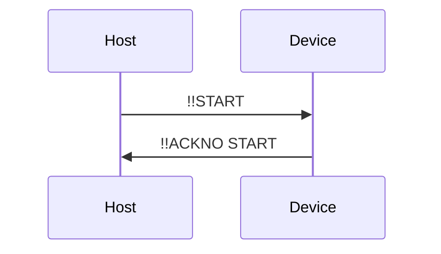


### 4.3 阶段 2：根操作指定

在收到 `START` 的 `ACKNO` 后，主机发送根操作命令，从而声明此次事务的意图。

四种根操作如下。


| 操作 | 对象 | 目的 |
| :--: | :--: | :-- |
| `SENDV` | 变量名 | 在设备上设置某变量。 |
| `REQUV` | 变量名 | 从设备请求某变量的值。 |
| `INVOK` | 方法名 | 在设备上调用某方法。 |
| `PKVER` | *(无)* | 查询设备的 PK 指令解释器版本。 |

示例时序如下。

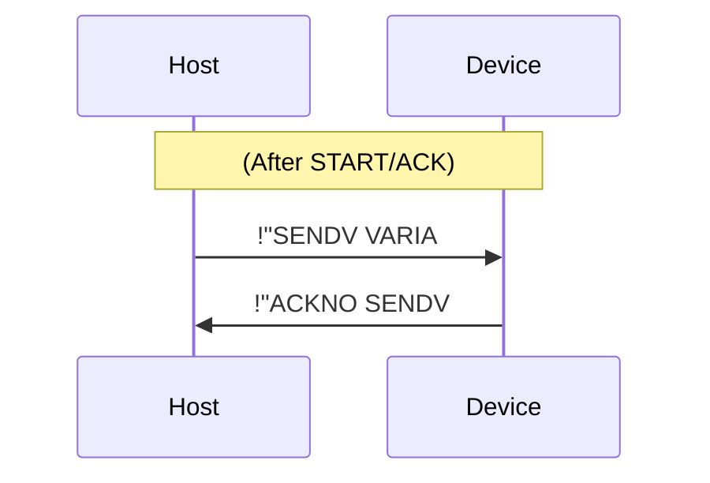


### 4.4 阶段 3：入站数据传输（主机 → 设备）

在根操作被 ACK 之后，主机应向设备传输参数数据，或说明无参数可传入。

#### 4.4.1 有入站数据的情况

若存在需要发送的数据，主机发送一条或多条 `SDATA` 命令，每条命令携带一段数据块。
`SDATA` 的 `OBJECT` 字段**必须**为根操作的名称。

示例如下。

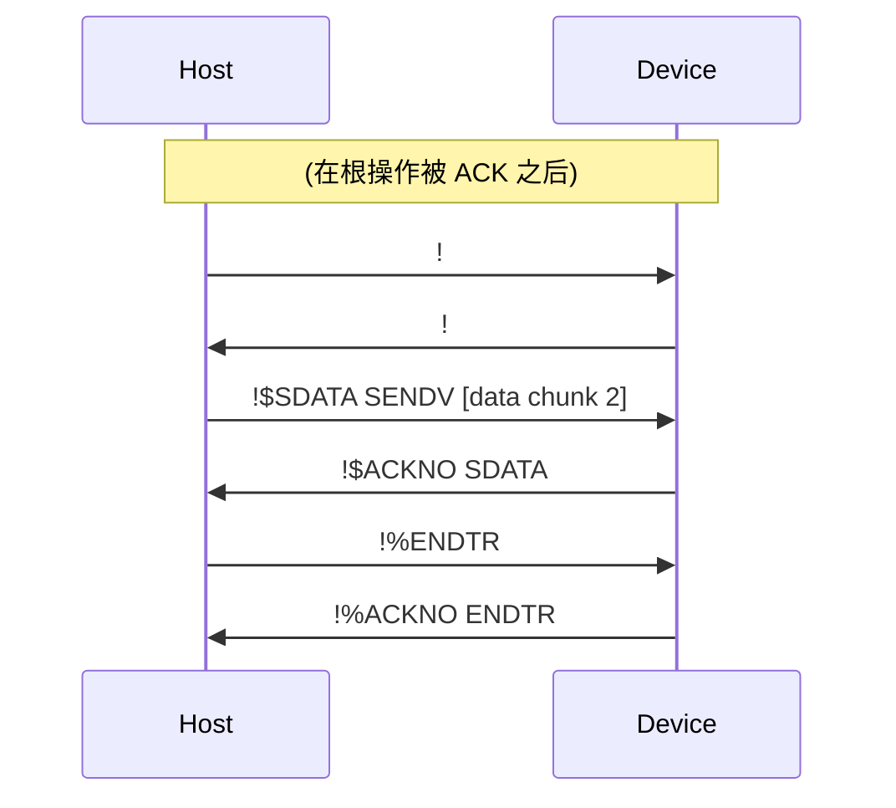


#### 4.4.2 无入站数据的情况

若无数据需要发送（例如 `REQUV` 或 `PKVER`），主机**必须**先发送 `EMPTY` 命令，随后发送 `ENDTR`。

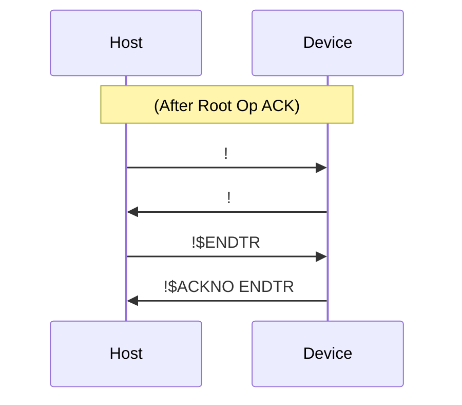

> 重要：没有数据时，`EMPTY` 命令也是强制要求的，它明确指示当前入站数据阶段为空，并保持阶段结构的一致性。

### 4.5 阶段 4：出站数据传输（Device → Host）

入站阶段完成后，主机发送 `QUERY` 命令以向设备请求结果。

#### 4.5.1 设备的“处理中”状态与保活机制

设备在收到 `QUERY` 后开始处理所请求的操作。若处理时间较长，设备应周期性地发送 `AWAIT` 命令以保持连接活跃。

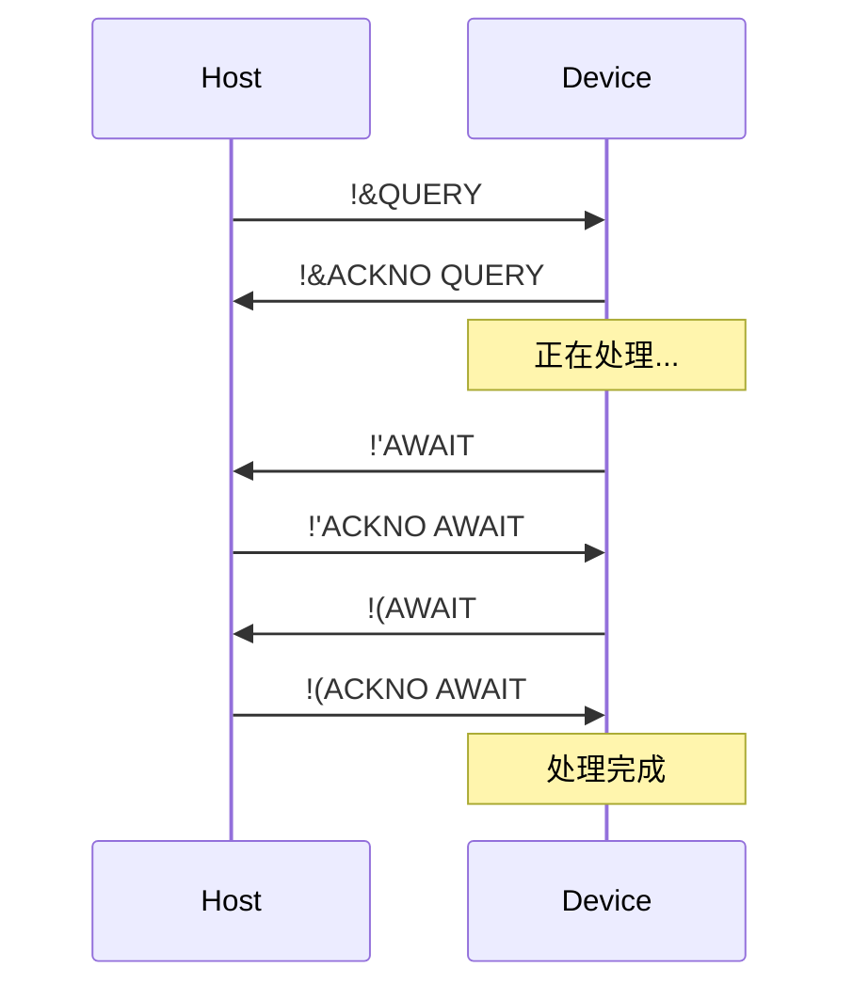


#### 4.5.2 使用 RTURN 返回数据

处理完成后，设备通过 `RTURN` 命令返回结果状态。

- **有数据返回**：`RTURN <ROOT_OP_NAME>` —— 其中 `OBJECT` 为根操作名称（如 `REQUV`、`INVOK`、`PKVER`）。
- **无数据返回**：`RTURN EMPTY` —— 其中 `OBJECT` 字段为 `EMPTY`。

示例（有出站数据的情况）：

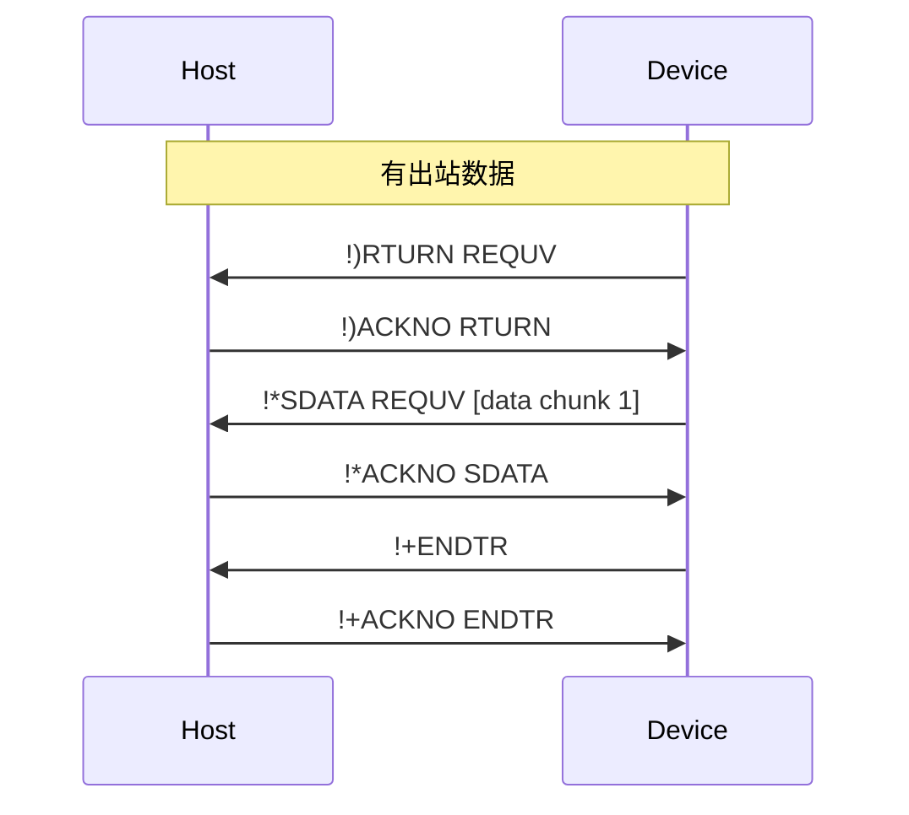

示例（无出站数据的情况）：

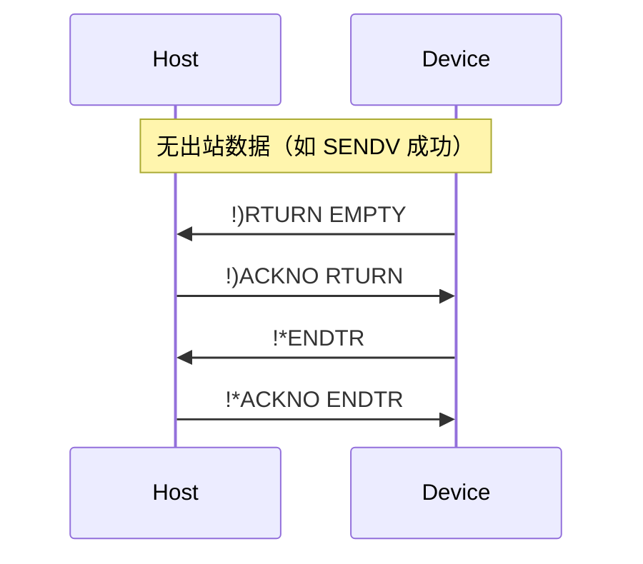

> 注意：在出站阶段中，`SDATA` 命令的 `OBJECT` 字段同样为根操作名称。

### 4.6 完整事务示例

#### 4.6.1 REQUV（请求变量）—— 无入站，有出站

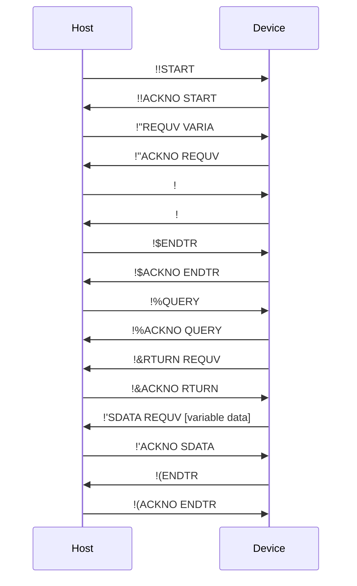


#### 4.6.2 SENDV（发送变量）—— 有入站，无出站

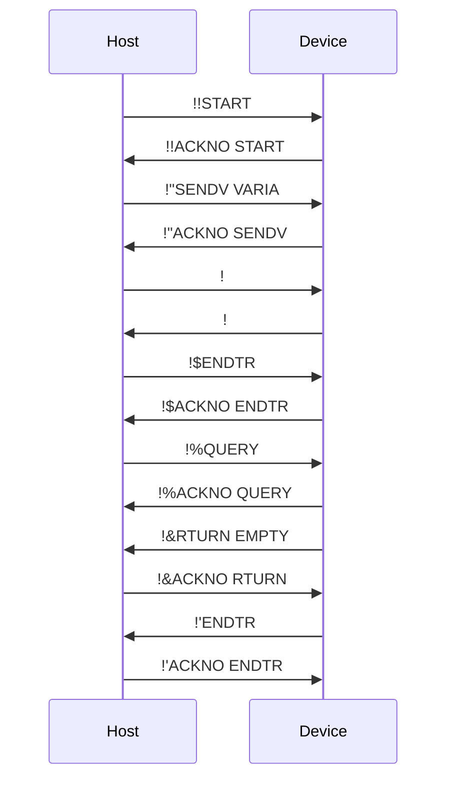


#### 4.6.3 INVOK（调用方法）—— 有入站、有出站，包含 AWAIT

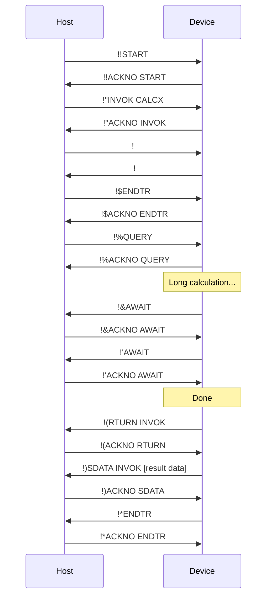


#### 4.6.4 PKVER（查询解释器版本）—— 无入站，有出站，无对象

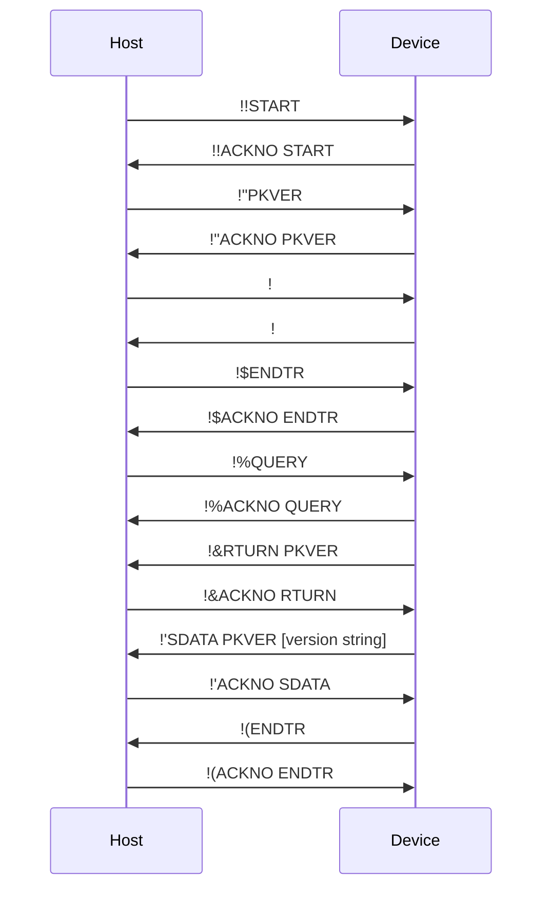


### 4.7 确认与重传机制

为保证传输可靠性，协议采用请求—响应机制。

#### 4.7.1 确认规则

- **强制应答**：除 `ACKNO` 本身以外，任何命令的接收方**必须**回复一条 `ACKNO` 命令。
- **格式**：`[MSG ID]ACKNO [OP_NAME]`。
    - `MSG ID`：必须与被确认命令的 `MSG ID` 完全一致。
    - `OP_NAME`：必须与被确认命令的 `OPERATION NAME` 完全一致。


#### 4.7.2 校验

发送方在收到 `ACKNO` 后，必须校验其中的 `MSG ID` 与 `OP_NAME` 是否与所发命令一致。
若不一致，应视为传输失败，并使用 `ERROR` 命令终止当前事务链。

#### 4.7.3 超时与重传

如果发送方在规定的超时时间内未收到有效 `ACKNO`，应使用**相同**的 `MSG ID` 重发上一条命令。
接收方可以利用 `MSG ID` 来识别并处理重复数据包。

## 5. 错误处理

当协议执行过程中发生不可恢复的错误（例如命令解析失败、访问对象不存在等），检测到错误的一方应发送 `ERROR` 命令。

### 5.1 ERROR 命令格式

```text
  ERROR ERROR [description]
```

- `MSG ID`：固定为两个空格字符（`0x20 0x20`）。
- `OPERATION NAME`：固定为 `ERROR`。
- `OBJECT`：固定为 `ERROR`。
- `DATA`：简短的英文错误描述。


### 5.2 ERROR 确认

`ERROR` 命令必须被如下命令确认。

```text
  ACKNO ERROR
```

此处 `MSG ID` 同样固定为两个空格字符。
若 `ACKNO` 超时，则需要重发 `ERROR` 命令。

### 5.3 后果

一旦 `ERROR` 命令被发送或接收，当前事务链立即失效，双方应执行如下操作。

1. 中止当前操作；
2. 重置内部状态；
3. 准备开始新的事务链。

> 警告：本协议的错误处理机制是基础的，主要用于处理偶然的运行时错误。
> 协议假定所有可预见、非偶然的逻辑错误在开发阶段被发现并解决。

## 6. 操作参考

### 6.1 根操作（Root Operations）

根操作被用于发起事务链，并声明事务链的目的，由主机在阶段 2 中发送。

| 名称 | 对象 | 有入站数据 | 有出站数据 | 说明 |
| :--: | :--: | :--: | :--: | :-- |
| `SENDV` | 变量名 | 是 | 否 | 在设备上设置变量。 |
| `REQUV` | 变量名 | 否 | 是 | 请求变量值。 |
| `INVOK` | 方法名 | 视情况而定 | 视情况而定 | 在设备上调用方法。 |
| `PKVER` | *(无)* | 否 | 是 | 获取对方的 PK 解释器版本。 |

\* `INVOK` 是否具有入站/出站数据取决于具体方法定义。

### 6.2 子操作（Sub-Operations）

子操作是在事务各阶段中使用的辅助命令。


| 名称 | 对象 | 数据 | 说明 |
| :--: | :--: | :--: | :-- |
| `START` | *(无)* | *(无)* | 启动新的事务链。 |
| `ENDTR` | *(无)* | *(无)* | 结束数据传输阶段或整个事务链。 |
| `ACKNO` | 被确认操作名 | *(无)* | 确认收到某命令。 |
| `QUERY` | *(无)* | *(无)* | 请求设备发送出站数据。 |
| `RTURN` | 根操作名或 `EMPTY` | *(无)* | 指示是否存在出站数据。 |
| `EMPTY` | *(无)* | *(无)* | 指示当前传输阶段无数据。 |
| `SDATA` | 根操作名 | 数据块 | 发送一段数据块。 |
| `AWAIT` | *(无)* | *(无)* | 设备执行长时间操作时，保持链接活跃。 |
| `ERROR` | `ERROR` | 错误描述 | 报告严重错误。 |

## 附录 A：时间建议

本协议不强制具体超时数值，但为提升互操作性，建议采用如下设置：


| 参数 | 建议值 | 说明 |
| :-- | :--: | :-- |
| **ACK 超时时间** | 100 ms | 等待 `ACKNO` 的时间，超时后应重发。 |
| **命令间超时时间** | 500 ms | 同一事务链中两条命令之间允许的最大空闲时间。 |
| **AWAIT 间隔** | 300 ms | 连续 `AWAIT` 保活命令之间的时间间隔。 |

## 附录 B：速查表——按根操作划分的命令序列

| 根操作 | 阶段 3（入站） | 阶段 4（出站） |
| :--: | :-- | :-- |
| `SENDV` | `SDATA...` → `ENDTR` | `QUERY` → `RTURN EMPTY` → `ENDTR` |
| `REQUV` | `EMPTY` → `ENDTR` | `QUERY` → `RTURN REQUV` → `SDATA...` → `ENDTR` |
| `INVOK` | `SDATA.../EMPTY` → `ENDTR` | `QUERY` → `[AWAIT...]` → `RTURN INVOK/EMPTY` → `[SDATA...]` → `ENDTR` |
| `PKVER` | `EMPTY` → `ENDTR` | `QUERY` → `RTURN PKVER` → `SDATA...` → `ENDTR` |

> 注意：除 `ACKNO` 外，所有命令均需要确认，表中为简洁起见省略了 `ACKNO`。

